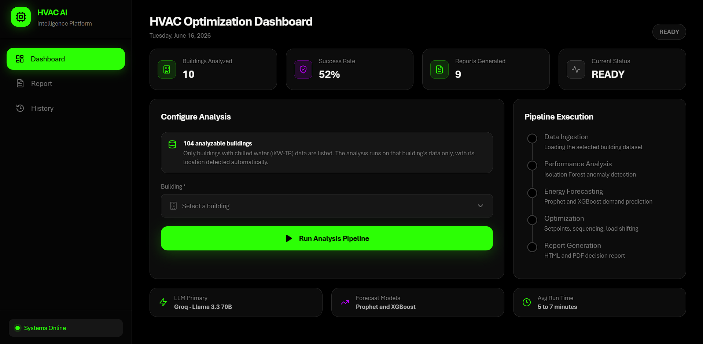
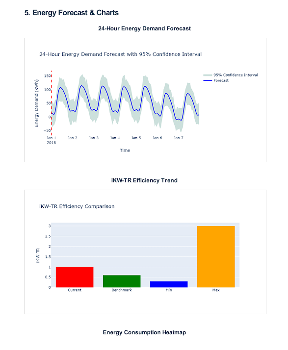

# Multi-Agent HVAC Optimization System

<div align="center">


**A production grade, local first multi-agent AI system that autonomously converts raw HVAC building energy data into explainable operational decisions and automated technical reports.**

[Features](#features) • [Architecture](#architecture) • [Agents](#agents) • [Dataset](#dataset) • [Quickstart](#quickstart) • [API](#api-reference) • [System Differentiation](#system-differentiation)

</div>

---

## Problem Statement

Commercial building HVAC systems consume nearly **40 percent of total building energy**, yet facility managers lack intelligent tools to convert raw operational data into timely, explainable decisions. Existing AI approaches rely on simulation environments, operate on single buildings, produce black box decisions, and fail to deliver actionable technical reports to human operators. This leaves a critical gap between AI research and real world facility management.

---

## Features

- **5 Agent CrewAI Pipeline:** Sequential multi-agent orchestration across Ingest, Analyze, Forecast, Optimize, and Report.
- **Per Building Analysis:** Each run slices the dataset down to the selected building before the agents start, so every report is specific to that one building rather than an average over the whole portfolio.
- **Searchable Building Picker:** Choose a building from the dashboard dropdown. Its coordinates are detected automatically from the dataset for weather forecasting, so a non technical user never types latitude or longitude.
- **Real Multi-Building Data:** Processes the BDG2 dataset of 307 commercial buildings, roughly 5.2 million hourly rows, spanning 2016 to 2017. The 104 buildings that include chilled water meters are fully analyzable for cooling efficiency.
- **4 Core HVAC Parameters:** kWh consumption, the iKW-TR efficiency metric, ambient conditions (temperature, humidity, wet bulb), and load profiles.
- **Genuine Anomaly Detection:** Isolation Forest combined with Z-Score, reporting only statistically extreme points with specific root causes (equipment, weather, behavioral, scheduling, or sensor) and the true anomaly count rather than a fixed list.
- **Energy Forecasting:** Prophet as the primary model with an XGBoost fallback, producing 24 hour and 168 hour horizons with confidence intervals.
- **Explainable Recommendations:** Every optimization action carries a written technical rationale.
- **Resilient to Rate Limits:** A deterministic analysis fallback runs the analysis tools directly when the LLM is unavailable, so a run still completes with a full report even if the model hits a free tier quota.
- **Token Efficient Context:** Tools return compact summaries while the full data is written to disk for the report, cutting per request tokens by about 99 percent to stay inside free tier limits.
- **Automated Reports:** Standalone PDF and HTML decision reports with Plotly charts, a clean black and white print theme, and an impact band that estimates annual kWh, cost, and CO2 savings.
- **Cross Platform PDF:** WeasyPrint on Linux and Docker, wkhtmltopdf on a Windows development box, selected automatically at runtime.
- **Desktop and Web Interface:** A React and Electron app with a Neon noir dashboard, report viewer, and analysis history, responsive down to mobile width.
- **Docker Support:** One command brings up the backend and frontend together.

---

## Previews

<p align="center">
  
  
</p>

---

## Architecture

```text
=======================================================================
                    REACT / ELECTRON APP
        Dashboard | Report Viewer | Analysis History
=======================================================================
                       | HTTP REST (localhost:8000)
=======================v===============================================
                    FASTAPI BACKEND
   POST /pipeline/run | GET /pipeline/status | GET /reports
   slice dataset to selected building  ->  inputs.data_path
=======================v===============================================
                       |
=======================v===============================================
                 CREWAI AGENT PIPELINE
                                                            
   [ Agent 1 ]  [ Agent 2 ]  [ Agent 3 ]  [ Agent 4 ]
   [ Ingest  ]->[ Analyze ]->[ Forecast]->[ Optimize]
                                              |
                                       [ Agent 5 ]
                                       [  Report ]
                                              |
            deterministic fallback fills any missing outputs,
            then renders HTML + PDF from the on disk results
=======================================================================
              |                    |                |
        [ SQLite DB ]      [ ChromaDB ]     [ File System ]
                                   ^
                           [ Open-Meteo API ]
```


---

## Agents

| # | Agent | Role | Key Capabilities |
|---|-------|------|-----------------|
| 1 | **Data Ingestion** | Data Engineer | Confirms the prepared per building dataset and hands its path to the next agents |
| 2 | **Performance Analyzer** | HVAC Diagnostician | Isolation Forest plus Z-Score anomaly detection, root cause classification, efficiency scorecard, degradation trend scoring, data quality report |
| 3 | **Forecasting** | Energy Forecaster | Prophet 24h and 168h forecasting, XGBoost fallback, weather adjusted predictions, peak demand window detection, confidence intervals |
| 4 | **Optimizer** | HVAC Consultant | Setpoint recommendations, chiller sequencing logic, load shift planning, maintenance priority scoring (0 to 100), ChromaDB memory of past runs |
| 5 | **Report Generator** | Technical Writer | Jinja2 HTML template, Plotly chart generation (trend, heatmap, forecast), WeasyPrint or wkhtmltopdf PDF export, executive summary, impact quantification |

Agents run sequentially. Because the actual analysis is performed by deterministic Python tools (Isolation Forest, Prophet, XGBoost), the LLM is used only for orchestration and reasoning. If the LLM is rate limited mid run, the backend runs the same tools directly so the report is still produced.

---

## Dataset

This system uses the **[Building Data Genome Project 2 (BDG2)](https://github.com/buds-lab/building-data-genome-project-2)**, a real world open dataset of commercial building energy consumption.

| Property | Value |
|----------|-------|
| Buildings | 307 (lodging, office, retail and more) |
| Analyzable for efficiency | 104 (the buildings that have chilled water meters and therefore iKW-TR) |
| Time Range | 2016 to 2017 (two full years) |
| Granularity | Hourly |
| Total Rows | about 5.2 million |
| Sites | Multiple (Panther, Fox, Eagle, Hog, Bull and others) |

**Files needed:**
```text
data/raw/
  chilledwater.csv     # Chilled water meter readings (kWh), wide format
  electricity.csv      # Electricity consumption (kWh), wide format
  weather.csv          # Hourly weather per site (temp, dewpoint, wind)
  metadata.csv         # Building info (type, size, lat/lng)
```

**Core parameters derived:**

| Parameter | Source | Formula |
|-----------|--------|---------|
| `kWh` | electricity.csv | Direct meter reading |
| `iKW-TR` | Both meter CSVs | `electricity_kW / (chilledwater_kWh * 0.9699)` |
| `Ambient Conditions` | weather.csv | airTemp and dewTemp give RH (Magnus) and WBT (Stull 2011) |
| `Load Profiles` | electricity.csv | Rolling average, percentile categorization, day patterns |

A building only receives the full efficiency and anomaly analysis when iKW-TR exists, which is why the dashboard lists the 104 analyzable buildings.

---

## Quickstart

### Option A: Docker (full stack, one command)

```bash
docker compose up --build
```

This builds the backend on port 8000 and the frontend on port 3000. The `data/` and `reports/` folders are mounted as volumes, so the dataset stays on the host. Put your keys in `.env` at the repo root. PDF rendering inside the container uses WeasyPrint, so wkhtmltopdf is not required.

### Option B: Local development

**Prerequisites**
- Python 3.11 or newer
- Node.js 18 or newer
- A [Groq API Key](https://console.groq.com/keys), free tier
- wkhtmltopdf is optional and only used on Windows. Linux and Docker use WeasyPrint.

**1. Clone and set up**
```bash
git clone https://github.com/yourusername/hvac-multiagent-system.git
cd hvac-multiagent-system

python -m venv venv

# Activate (Windows)
venv\Scripts\activate
# Activate (macOS or Linux)
source venv/bin/activate

pip install -r requirements.txt
```

**2. Configure environment**
```bash
cp .env.example .env
```

Edit `.env`:
```env
GROQ_API_KEY=your_groq_key_here
DATABASE_URL=sqlite:///./hvac_system.db
REPORTS_DIR=reports
DATA_DIR=data
LOG_LEVEL=INFO
```

**3. Prepare the dataset**

Download BDG2 and place the four CSVs in `data/raw/`, then run:
```bash
python scripts/prepare_data.py        # builds data/processed/features_final.csv
python scripts/generate_buildings.py  # builds the building catalogue for the picker
```

**4. Start the backend**
```bash
uvicorn backend.main:app --port 8000
```
Check `http://localhost:8000/health`.

**5. Start the frontend**
```bash
cd frontend
npm install
npm run dev        # web dashboard at http://localhost:3000
npm run electron   # optional desktop window (needs the dev server running)
```

**6. Run an analysis**

Open the app, go to the Dashboard, pick a building from the dropdown, then click **Run Analysis Pipeline**. Progress streams live, and the report opens automatically when the run completes.

---

## Testing

```bash
python tests/fixtures/generate_fixtures.py
pytest tests/ -v --cov=backend --cov-report=term-missing
```

| Module | Coverage |
|--------|----------|
| anomaly_tools.py | 72% |
| forecast_tools.py | 84% |
| data_tools.py | 63% |
| optimization_tools.py | 54% |
| report_tools.py | 72% |

On Windows, three tool tests (anomaly, forecast, report) currently fail with a path error (Errno 22) because the tool functions receive a JSON string where the test passes a path. This is a known platform quirk. The data and optimization suites pass.

---

## API Reference

### Base URL: `http://localhost:8000/api/v1`

| Endpoint | Method | Description | Request Body |
|----------|--------|-------------|-------------|
| `/pipeline/run` | POST | Trigger the full 5 agent pipeline | `{building_id, latitude, longitude, forecast_horizon_hours}` |
| `/pipeline/status/{run_id}` | GET | Poll pipeline execution status and progress | None |
| `/pipeline/stats` | GET | Dashboard metrics (buildings analyzed, success rate, reports) | None |
| `/buildings` | GET | Building catalogue for the picker, with the analyzable flag | None |
| `/reports/{run_id}` | GET | Get the HTML report plus metadata | None |
| `/reports/{run_id}/pdf` | GET | Download the PDF report | None |
| `/history` | GET | Last 50 pipeline runs | None |
| `/history` | DELETE | Clear all runs and their report files | None |
| `/health` | GET | Health check | None |

---

## System Differentiation

This platform bridges the gap between academic HVAC research and practical industry application. It targets limitations identified in modern systematic reviews, for example *Aghili et al., "Artificial Intelligence Approaches to Energy Management in HVAC Systems", Buildings 2025*.

| Common Industry Limitation | System Approach |
|---|---|
| Black box AI without explainability | Every recommendation includes a technical rationale for operators |
| Systems bound to simulated datasets | Validated entirely on the real world BDG2 dataset of 307 buildings |
| Lacking facility manager interfaces | A dedicated React and Electron desktop app tailored for non technical users |
| Missing automated documentation | Standalone PDF and HTML decision reports generated per run |
| Pure algorithmic logic without reasoning | A CrewAI multi-agent orchestration layer (Groq Llama 3.3 70B, with Gemini as fallback) |

Reported savings are bounded to the 12 to 40 percent range supported by the AI HVAC literature. The architecture shows that multi-agent systems can handle end to end data ingestion, algorithmic forecasting, and explainable reporting locally without leaning heavily on cloud infrastructure.

---

## Challenges and Learnings

- **Per building correctness:** Early versions read the whole processed CSV in every tool, so every report was an average over all 307 buildings. The fix slices the dataset to the selected building before the agents run, which made each report genuinely building specific.
- **Free tier rate limits:** A single agent step can need about 17,000 tokens, which exceeds the Groq free tier ceiling of 12,000 tokens per minute. This was solved by returning compact tool summaries (full data still saved to disk) and by adding a deterministic fallback that completes the analysis without the LLM.
- **Legitimate anomalies:** Contamination based flagging marked a fixed five percent of every building as anomalous, so reports looked identical. Anomalies now require both an Isolation Forest flag and a statistically extreme Z-Score, which yields true, variable counts with specific root causes.
- **Agent hallucinations in technical output:** Agents were equipped with rigid deterministic tools (Isolation Forest, Prophet, XGBoost) and the LLM is used only for orchestration, not raw math.
- **Cross platform PDF:** wkhtmltopdf was removed from Debian 13, so PDF rendering falls back to WeasyPrint inside containers while still using wkhtmltopdf on a Windows box.
- **Asynchronous AI with a responsive UI:** Long running pipelines are dispatched to a background task with SQLite state tracking and progress polling, so the interface stays responsive throughout the run.

---

## Project Structure

```text
hvac-multiagent-system/
  backend/
    main.py                    # FastAPI app, logging, startup key validation
    config.py                  # Settings from .env
    database.py                # SQLAlchemy models
    pipeline.py                # Async runner, per building slice, deterministic fallback
    agents/
      agent_definitions.py     # The 5 CrewAI agents
      task_definitions.py      # The 5 CrewAI tasks
      crew.py                  # Crew assembly and rate limiting
      tools/                   # Agent tools (anomaly, forecast, optimize, report, etc.)
    routers/                   # API routes
    templates/                 # Report Jinja2 template
  frontend/                    # React and Electron app (Neon noir theme)
  scripts/
    prepare_data.py            # Build the processed dataset
    generate_buildings.py      # Build the building catalogue
    regen_report.py            # Regenerate any run's report from disk
    inspect_data.py            # Quick data inspection helper
  data/                        # BDG2 datasets (raw and processed, not committed)
  reports/                     # Generated PDF and HTML reports (not committed)
  tests/                       # pytest suite
  Dockerfile                   # Backend image
  frontend/Dockerfile          # Frontend image
  docker-compose.yml           # Full stack
```

---

## Tech Stack

| Layer | Technology |
|-------|-----------|
| **Multi-Agent Framework** | CrewAI |
| **LLM** | Groq Llama 3.3 70B (primary), Google Gemini 2.5 Flash (fallback) |
| **Backend API** | FastAPI and Uvicorn |
| **Machine Learning** | Scikit-learn, Prophet, XGBoost |
| **Memory and Database** | ChromaDB, SQLite |
| **Data Processing** | Pandas, NumPy |
| **Reporting** | Jinja2, Plotly, WeasyPrint |
| **Desktop and Frontend** | Electron, React 18, TailwindCSS |
| **Deployment** | Docker, Docker Compose |

---

## Acknowledgements

- Building Data Genome Project 2, Miller et al., for the open dataset.
- CrewAI, the framework for multi-agent orchestration.
- Open-Meteo, the open source weather API.

<div align="center">
Built as a production grade AI engineering portfolio project
</div>
